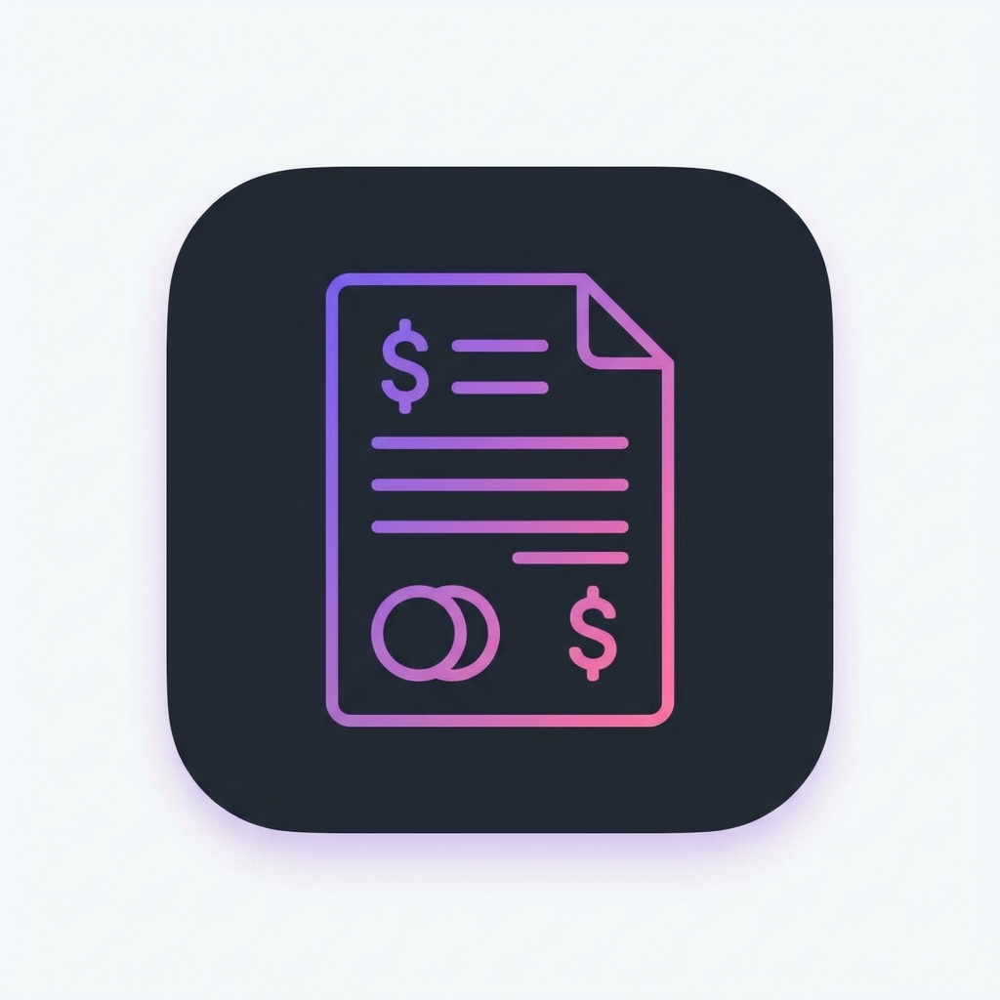

# Payment Voucher Desktop App

A professional desktop application for creating, managing, and printing payment vouchers. Built with **Electron**, **React**, and **Vite**, this application offers a modern, glassmorphism-inspired UI with robust local database management.



## 🚀 Key Features

* **Native Desktop Experience**: Cross-platform support for Windows, macOS, and Linux.
* **Modern UI**: Clean, responsive interface built with Tailwind CSS.
* **Multi-Company Support**: Built-in toggle to switch between entities (e.g., Mentari Infiniti, NES Solution).
* **Voucher Management**:
    * **Create**: Auto-generated PV numbers and dynamic item entry.
    * **History & Search**: Searchable database of past vouchers by PV Number, Payee, or Company.
    * **Digital Signatures**: Support for uploading signature images for Prepared, Approved, and Received fields.
* **Data Persistence**: Uses `NeDB` for a local, offline-capable database.
* **PDF Export**: Professional A4 PDF generation for printing or archiving.
* **Backup**: Built-in utility to backup your database.

## 🛠️ Tech Stack

* **Runtime**: [Electron](https://www.electronjs.org/)
* **Frontend**: [React](https://react.dev/) + [Vite](https://vitejs.dev/)
* **Styling**: [Tailwind CSS](https://tailwindcss.com/)
* **Icons**: [Lucide React](https://lucide.dev/)
* **Database**: [NeDB Promises](https://github.com/bajankristof/nedb-promises)
* **Packaging**: [Electron Builder](https://www.electron.build/)

## 📦 Installation & Setup

### Prerequisites

* Node.js v18 or higher ([Download](https://nodejs.org/))

### Development Setup

1.  **Clone the repository** (or navigate to the project directory):
    ```bash
    cd payment-voucher-desktop
    ```

2.  **Install Dependencies**:
    ```bash
    npm install
    ```

3.  **Run in Development Mode**:
    ```bash
    npm run electron:dev
    ```
    *This starts the Vite development server (port 5173) and launches the Electron window.*

## 🏗️ Building for Production

To create an installer for your operating system, run the appropriate command:

| OS | Command | Output Location |
| :--- | :--- | :--- |
| **Windows** | `npm run dist:win` | `dist-electron/*.exe` |
| **macOS** | `npm run dist:mac` | `dist-electron/*.dmg` |
| **Linux** | `npm run dist:linux` | `dist-electron/*.AppImage` & `.deb` |

## 📖 Usage Guide

### 1. Creating a Voucher
* **Company Selection**: Choose the issuing company from the dropdown at the top.
* **PV Number**: Automatically generated based on the year, month, and a running counter.
* **Details**: Fill in "Pay To", "Payment Method", and add line items. The total is calculated automatically.
* **Signatures**: Click the "Signature" button under the Prepared/Approved/Received fields to upload an image signature.

### 2. Managing Data
* **Save**: Click **Save** (or `Ctrl+S`) to store the voucher in the local database.
* **History**: Click **History** (or `Ctrl+H`) to view past vouchers. You can search by text or delete entries.
* **Backup**: Go to `File > Backup Database` in the menu bar to save a copy of your data.

### 3. Printing
* Click **Print** (or `Ctrl+P`) to generate a PDF. The output is formatted strictly for A4 paper.

### Keyboard Shortcuts

| Action | Shortcut (Win/Linux) | Shortcut (Mac) |
| :--- | :--- | :--- |
| New Voucher | `Ctrl + N` | `Cmd + N` |
| Save Voucher | `Ctrl + S` | `Cmd + S` |
| View History | `Ctrl + H` | `Cmd + H` |
| Export PDF | `Ctrl + P` | `Cmd + P` |

## 📂 Project Structure

```text
payment-voucher-desktop/
├── electron/
│   ├── main.js          # Electron main process & IPC handlers
│   └── database.js      # NeDB database logic (init, save, search)
├── src/
│   ├── App.jsx          # Main React component & UI logic
│   └── main.jsx         # React entry point
├── build/               # Icons and build resources
├── dist-electron/       # Output folder for compiled installers
└── vite.config.js       # Vite configuration
